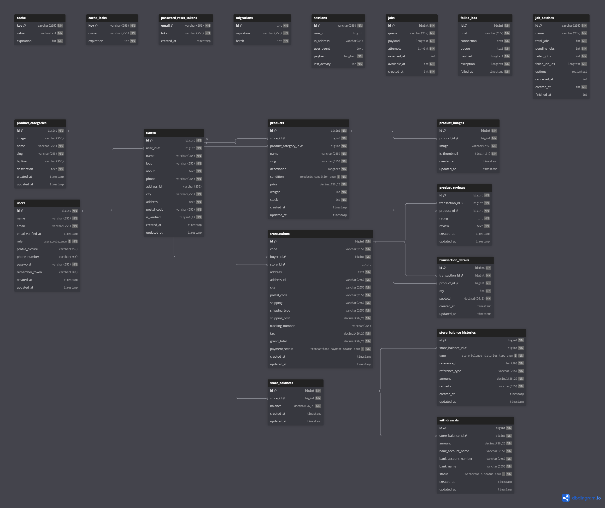

# Hardware_JosJis 🛒

**Anggota** = **Sayyid Ilmi Hubballillah (245150600111027)**
              **Sugeng Riadika (245150600111020)**

**Hardware_JosJis** merupakan platform e-commerce berbasis web yang dirancang khusus untuk transaksi jual-beli perangkat keras komputer (hardware) dan laptop. Aplikasi ini dibangun menggunakan framework **Laravel** dengan antarmuka yang responsif dan sistem manajemen toko yang komprehensif.

  

## 📋 Urutan Penggunaan

* **Admin =>** "Register"->"login"->bisa memverifikasi toko di "dashboard"->manajemen toko di sidebar "data toko"->manajemen user di "data toko" untuk edit user yang nama nya sensitif dan menghapus user jika diperlukan
* **Member =>** "Register"->"login"->top up terlebih dahulu di "topup saldo" -> checkout product yang ingin dibeli di"dashboard","kategori produk","toko kami"-> bisa memilih berapa banyak barang yang ingin dibeli-> checkout-> menunggu di proses toko-> lihat "riwayat transaksi" untuk melihat list pemesanan 
* **Seller =>:** "Register"->"login"->mendaftar toko di "toko saya"-> menunggu diverifikasi admin-> di dashboard mystore bisa melihat saldo toko,pesanan terbarubisa menambah produk di->"manajemen produk" (menambah,edit,delete produk), meng-acc pesanan masuk di "pesanan masuk"-> mencairkan saldo toko ke rekening di "saldo toko"

---
## 📋 Fitur Utama

Aplikasi ini membagi pengguna menjadi tiga peran utama dengan fungsionalitas berbeda:

### 1. Autentikasi & Pengguna (User)
* **Custom Login & Register:** Desain halaman masuk dan daftar yang terpisah (split-screen) dengan validasi input realtime.
* **Multi-Role System:** Mendukung peran Member (Pembeli), Seller (Penjual), dan Admin.

### 2. Member (Pembeli)
* **Katalog & Pencarian:** Menjelajahi produk berdasarkan kategori atau menggunakan fitur pencarian kata kunci.
* **Keranjang & Checkout:** Membeli produk dengan sistem validasi stok otomatis dan pengurangan saldo.
* **Top Up Saldo:** Fitur simulasi pengisian saldo akun untuk bertransaksi.
* **Riwayat Transaksi:** Memantau status pesanan dan saldo yang dimiliki(Diproses, Dikirim, Selesai).

### 3. Seller (Penjual)
* **Manajemen Toko:** Mendaftarkan toko baru dengan logo dan deskripsi kustom.
* **Manajemen Produk (CRUD):** * Menambah produk baru dengan upload gambar.
    * Mengedit detail produk (Harga, Stok, Berat, Deskripsi).
    * Menghapus produk.
* **Manajemen Pesanan:** Memproses pesanan masuk, update status pengiriman, dan input nomor resi.
* **Keuangan & Penarikan Dana:**
    * Dashboard ringkasan pendapatan.
    * Fitur *Withdrawal* (Tarik Dana) ke rekening bank pilihan.

### 4. Admin
* **Verifikasi Toko:** Menyetujui atau menolak pengajuan pembukaan toko baru.
* **Manajemen User:** Mengelola data pengguna aplikasi.

---
## 🛠️ Teknologi yang Digunakan

* **Admin:** Email admin@gmail.com PW admin123
* **Member:** Email superimpact@gmail.com PW superimpact123 atau Register saja
* **Seller:** Email gasol@gmail.com PW gasol123 atau Register saja kemudian pergi ke Toko saya dan mengisi form, kemudian meminta validasi dari role admin di verifikasi toko
---

## 🛠️ Teknologi yang Digunakan

* **Backend:** PHP (Laravel Framework)
* **Frontend:** Blade Templating Engine
* **Database:** MySQL
* **Styling:** Custom CSS (Flexbox Layout) & FontAwesome Icons
* **Autentikasi:** Laravel Auth

---

## ⚙️ Persyaratan Sistem

Pastikan komputer Anda telah terinstal:
* PHP >= 8.3x
* Composer
* MySQL 
* Web Server (Apache/Nginx/Laragon/XAMPP)

---
## ⚙️ struktur tabel



## 🚀 Cara Instalasi

Ikuti langkah-langkah berikut untuk menjalankan proyek di lokal:

1.  **Clone Repositori**
    ```bash
    git clone [https://github.com/SayyidIlmi/E-Commerce-PEMWEB-UAP-2025-8.git]
    cd E-Commerce-PEMWEB-UAP-2025-8
    ```

2.  **Install Dependencies**
    ```bash
    composer install
    ```

3.  **Konfigurasi Environment**
    Salin file contoh `.env` dan atur database:
    ```bash
    cp .env.example .env
    ```
    Buka file `.env` dan sesuaikan koneksi database:
    ```env
    DB_DATABASE=nama_database_anda
    DB_USERNAME=root
    DB_PASSWORD=
    ```

4.  **Generate Key & Migrasi Database**
    ```bash
    php artisan key:generate
    php artisan migrate -seed
    ```

5.  **Setup Storage Link**
    Agar bisa Berjalan:
    ```bash
    npm install && npm run build
    ```

6.  **Jalankan Server**
    ```bash
    php artisan serve
    ```
    Buka browser dan akses: `http://localhost:8000`

---

## 📂 Struktur File Penting

Berikut adalah lokasi file logika utama dalam proyek ini:

* **Controller Utama Member:** `app/Http/Controllers/MemberController.php` (Mengatur logika Member & Seller).
* **Controller Utama Admin:** `app/Http/Controllers/AdminController.php` (Mengatur logika Admin).
* **Routing:** `routes/web.php`,`routes/auth.php`  (Mengatur alur URL dan Middleware).
* **Views (Frontend):**
    * `resources/views/auth/`: Halaman Login & Register.
    * `resources/views/member/`: Halaman Dashboard, Produk, dan Toko.
    * `resources/views/admin/`: Halaman Dashboard admin.
* **Styling:** `public/style.css`.

---
